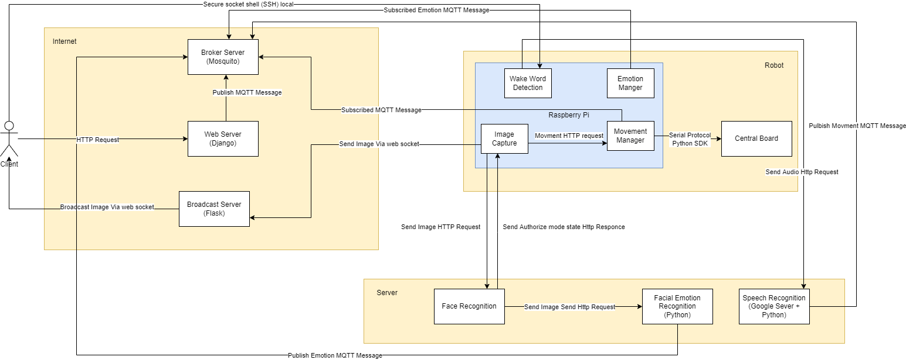
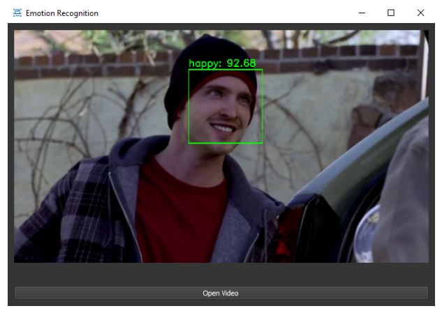

# Social-robot

## Introduction

The **Social-robot** project is an open-source framework for building personal assistant robots designed to interact naturally with users. It combines data mining, natural language processing, and interactive capabilities, aiming to create a responsive and intelligent robot assistant. This project is suited for developers, researchers, and enthusiasts interested in advancing social robotics and human-robot interaction.



## Data Mining

The data mining module is responsible for extracting insights from user interactions and other data sources, which help in enhancing the robot's responses and behaviors.

To run the data mining process:
```python
python Data_Mining.py
```



## Robot

The **Robot** module comprises the main functionality of the social assistant robot, integrating voice recognition, text-based command processing, and natural responses. This module includes the following capabilities:

- **Voice and Text Interaction**: Process both verbal and written commands.
- **Real-time Response Generation**: The robot processes commands instantly, providing visual or vocal feedback.
- **Machine Learning Integrations**: Supports customizable machine learning models for adapting responses over time based on user interactions.

## How to Run

1. **Clone the Repository**:
   ```bash
   git clone https://github.com/MohammadJRanjbar/Social-robots-an-open-source-framework-for-personal-assistant-robots.git
   cd Social-robots-an-open-source-framework-for-personal-assistant-robots
   ```


## To Do

- [ ] Complete the README with detailed descriptions.
- [ ] Add a "How to Run" section with setup and configuration details.
- [ ] Add citation instructions for referencing this project in academic work.

## Citation

If you use this framework in your research or project, please cite it as follows:

```
@INPROCEEDINGS{Ranjbar2022socialrobot,
  author={Mohammad Javad Ranjbar Kalharoodi and Mohammad Bagher Menhaj and Hassan Taheri},
  title={Social Robots: An Open-Source Architecture for Personal Assistant Robots},
  booktitle={2022 10th RSI International Conference on Robotics and Mechatronics (ICRoM)},
  year={2022},
  pages={1-6},
  publisher={IEEE},
  doi={10.1109/ICRoM57054.2022.10025253},
  url={https://ieeexplore.ieee.org/document/10025253}
}

```
